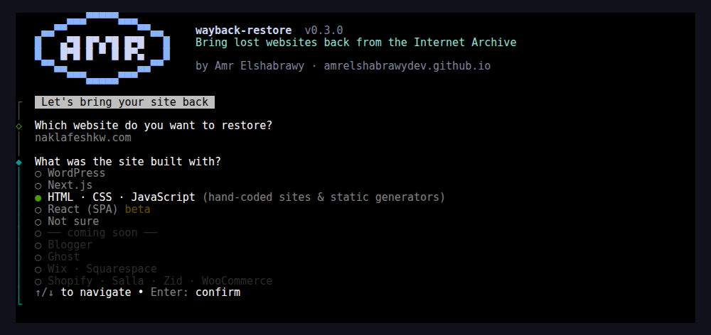
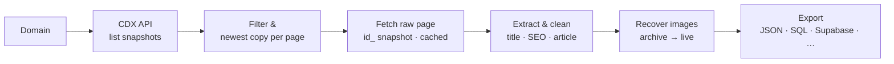

<div align="center">


# wayback-restore

**Your website is gone. Its content doesn't have to be.**

Bring a lost website back from the Internet Archive — **WordPress, Next.js, React or plain HTML/CSS/JS** — posts, pages and images, with the original URLs, SEO data and Arabic/RTL slugs intact — and import it into **Supabase, Prisma, PostgreSQL, MySQL, SQLite, MongoDB, Markdown, CSV or WordPress**.

[](https://www.npmjs.com/package/@amrelshabrawydev/wayback-restore)
[](package.json)
[](LICENSE)
[](CONTRIBUTING.md)

```bash
npx @amrelshabrawydev/wayback-restore
```


</div>

---

## 📖 Contents

- [The problem](#-the-problem)
- [The solution](#-the-solution)
- [Features](#-features)
- [Supported sites](#-supported-sites)
- [Quick start](#-quick-start)
- [Exports](#%EF%B8%8F-exports)
- [Options](#%EF%B8%8F-options)
- [Use it from code](#-use-it-from-code)
- [How it works](#-how-it-works)
- [Good to know](#-good-to-know)
- [Roadmap](#%EF%B8%8F-roadmap)
- [Contributing](#-contributing)
- [Let's connect](#-lets-connect)

## 🔥 The problem

Websites disappear more often than you'd think:

- the **database gets corrupted or wiped** and the last backup is months old — or never existed,
- the site is **hacked**, and the clean version is gone,
- **hosting expires**, the old developer vanishes, and nobody has the login,
- a **redesign or migration** goes wrong and the old content is lost.

The site is gone, but **Google still remembers it**. Old articles keep showing up in search results and keep sending visitors — straight to error pages. Every day offline, rankings fade and customers go to competitors.

This happened to one of my clients: a moving company in Kuwait whose WordPress database was destroyed **with no backup**, while Google was still showing **182 of its Arabic articles** — the company's main source of customer calls.

The content still existed in one place: the **[Internet Archive's Wayback Machine](https://web.archive.org)**. But copying 182 articles by hand — titles, meta descriptions, images, exact URLs — would take weeks, and the archived pages are full of theme clutter, broken lazy-loaded images and rewritten `web.archive.org` links.

## 💡 The solution

**wayback-restore** automates the whole recovery. You give it a domain; it gives you clean, import-ready content:

1. **Finds** every page of the site the archive ever saved, and keeps the newest good copy of each.
2. **Filters** out the noise — tag archives, feeds, admin pages, attachments, files.
3. **Extracts** what matters: title, meta description, dates, author, categories, tags, featured image and the article itself.
4. **Cleans** the article: no share buttons, ads, page-builder wrappers or archive links — just the content.
5. **Recovers images** from the archive (or the live site), and removes the ones that are truly lost instead of leaving broken `` tags.
6. **Keeps your URLs** exactly as Google knows them — including Arabic slugs like `/نقل-عفش-الكويت/` — so your rankings survive.
7. **Exports** to the platform you're moving to, with ready-to-run import files.

That client's articles came back at their original addresses, on a new Next.js site. This tool is the reusable version of that recovery — read the full story: [How I recovered 182 articles from the Internet Archive](https://amrelshabrawydev.github.io/blog/wordpress-to-nextjs-arabic-migration) (Arabic) · [WordPress to Next.js migration without losing SEO](https://amrelshabrawydev.github.io/blog/wordpress-to-nextjs-migration-seo).

## ✨ Features

| | |
|---|---|
| 🧭 **Interactive mode** | Run it with no arguments and answer a few questions — like `create-next-app`. Starts with a safe 5-page test. |
| 🧱 **Any kind of site** | WordPress, Next.js, React and hand-coded HTML/CSS/JS — detected automatically for every page. |
| 🔎 **Finds everything** | Lists every archived page through the Wayback CDX API and merges `http`/`https`/`www` duplicates. |
| 🕰️ **Pick the right version** | Restore the latest copy, or the last one **before the site was hacked or redesigned** (`--to 2024-06`). |
| 🧹 **Clean content** | Removes share buttons, ads, TOC widgets, comments, inline styles and Elementor/page-builder wrappers. Keeps YouTube/Vimeo/Maps embeds. |
| 🏷️ **SEO preserved** | Title, meta description (Yoast / Rank Math), canonical, published & modified dates, categories, tags. |
| 🔗 **Same URLs** | Original slugs kept and decoded (Arabic, RTL and any language); internal links become root-relative. |
| 🖼️ **Image recovery** | Lazy-loaded images unwrapped, downloaded (archive → live site), paths rewritten; missing images removed cleanly. |
| 🗄️ **10 export targets** | Supabase, Prisma, PostgreSQL, MySQL, SQLite, MongoDB, Markdown, CSV, JSON and WordPress (WXR). |
| 🔒 **No credentials needed** | Never connects to your database. Generated import scripts read keys from environment variables only. |
| ♻️ **Resumable** | Every page is cached — an interrupted run continues where it stopped, without hitting the archive again. |
| 📋 **Clear report** | `report.json` lists what was restored, skipped (and why), failed, and which images are missing. |
| 🤝 **Respectful** | Polite delays and retries with backoff, so the free Internet Archive isn't overloaded. |

## 🧱 Supported sites

<div align="center">


</div>

<br/>

| | Built with | Status | What comes back |
|:---:|---|:---:|---|
|  | **WordPress** | ✅ Ready | Posts & pages, Yoast / Rank Math SEO, dates, categories, tags, featured image — page-builder clutter removed |
|  | **Next.js** | ✅ Ready | Every server-rendered or static page, without header/nav/footer; `/_next/image` URLs turned back into the original images |
|  | **HTML · CSS · JavaScript** | ✅ Ready | Hand-coded sites and static generators (Hugo, Jekyll, Astro…): `about.html`-style URLs, the homepage, relative images |
|  | **React (SPA)** | 🧪 Beta | Pages the archive saved with their content (pre-rendered / SSR). Empty client-side shells are skipped and listed in `report.json` |
| 🔎 | **Not sure?** | ✅ Default | `--platform auto` detects the platform **for each page** and counts them in `report.json` |
| 🔜 | Blogger · Ghost · Wix · Squarespace | Soon | Planned for v0.4 — see the [roadmap](ROADMAP.md) |
| 🛒 | Shopify · Salla · Zid · WooCommerce | Soon | Products and collections — v0.5 |

```bash
npx @amrelshabrawydev/wayback-restore my-next-site.com --platform nextjs --format md
npx @amrelshabrawydev/wayback-restore old-portfolio.com --platform static
```

In interactive mode it's the second question — pick one, or **Not sure** to let the tool decide:

<div align="center"></div>

<details>
<summary><b>How is the platform detected?</b></summary>

<br/>

| Platform | Signals in the archived HTML |
|---|---|
| WordPress | `<meta name="generator" content="WordPress">`, `/wp-content/`, `wp-json` |
| Next.js | `__NEXT_DATA__`, `/_next/static/`, App Router `self.__next_f` |
| React (SPA) | An empty `#root` / `#app` mount, `/static/js/main.*.js` (Create React App), `/assets/index-*.js` (Vite) |
| HTML · CSS · JS | Anything else |

Build files (`/_next/`, `/static/js/`, `/assets/`, `/api/`) are never mistaken for pages.

</details>

> [!NOTE]
> **Why is React "beta"?** A single-page React app loads its content with JavaScript *after* the page opens, so the Internet Archive often saved only an empty `<div id="root">`. There's nothing to restore in those pages — the tool tells you so instead of producing blank posts. React sites built with **Next.js, Gatsby or Remix** are server-rendered and restore fine.

## 🚀 Quick start

Requires **Node.js 20.18+**.

**Interactive** (recommended):

```bash
npx @amrelshabrawydev/wayback-restore
```

It asks for the domain, what the site was built with, where you'll import the content, which version of the site to use, which pages, and whether to download images — then offers a **quick 5-page test** before the full run, and prints the one-line command to repeat it.

**One command** (scripts, CI):

```bash
# see what would be restored — only queries the archive index
npx @amrelshabrawydev/wayback-restore example.com --dry-run

# try 5 pages first
npx @amrelshabrawydev/wayback-restore example.com --limit 5

# restore everything for Supabase + Markdown
npx @amrelshabrawydev/wayback-restore example.com --format supabase,md
```

Or install it once and use the short command:

```bash
npm i -g @amrelshabrawydev/wayback-restore
wayback-restore example.com
```

### What you get

```
restored/
├── posts.json          # every post, newest first
├── posts/              # Markdown files (with --format md)
├── supabase/ prisma/ sql/ mongodb/ wordpress/   # per --format
├── public/             # recovered images, mirroring their original paths
│   └── wp-content/uploads/2023/05/team.jpg
├── report.json         # restored / skipped / failed pages, missing images
└── .cache/             # raw archived HTML (delete to re-download)
```

Copy `public/` into your app's `public/` folder and every image URL (`/wp-content/uploads/…`) keeps working unchanged.

## 🗄️ Exports

Choose one or more with `--format` (or in interactive mode). Every export is a **file you run yourself** — the tool never connects to your database.

| `--format` | You get | How to import |
|---|---|---|
| `json` *(default)* | `posts.json` | Anything |
| `md` | `posts/<slug>.md` with frontmatter | Copy into Next.js / Astro / Hugo / Jekyll content |
| `supabase` | `supabase/migration.sql` (with RLS), `supabase/import-posts.mjs` | Run the SQL in Supabase, then `SUPABASE_URL=… SUPABASE_SERVICE_ROLE_KEY=… node restored/supabase/import-posts.mjs` |
| `prisma` | `prisma/model.prisma`, `prisma/import-posts.mjs` | Add the model, `prisma migrate dev`, then `node restored/prisma/import-posts.mjs` |
| `postgres` | `sql/posts.postgres.sql` | `psql "$DATABASE_URL" -f restored/sql/posts.postgres.sql` |
| `mysql` | `sql/posts.mysql.sql` (utf8mb4) | `mysql -u user -p db < restored/sql/posts.mysql.sql` |
| `sqlite` | `sql/posts.sqlite.sql` | `sqlite3 site.db < restored/sql/posts.sqlite.sql` |
| `mongodb` | `mongodb/posts.ndjson` | `mongoimport --uri "$MONGODB_URI" --collection posts --file restored/mongodb/posts.ndjson` |
| `csv` | `posts.csv` (UTF-8 BOM — Arabic opens correctly in Excel) | Excel, Google Sheets, Airtable, Notion |
| `wordpress` | `wordpress/wordpress-export.xml` (WXR) | A fresh WordPress: **Tools → Import → WordPress** |

All SQL files create the table if needed and **upsert on `slug`**, so running them twice is safe. `--table articles` changes the table name.

Every database export uses the same columns:

`slug` (primary key) · `path` · `title` · `excerpt` · `content` (HTML) · `featured_image` · `published_at` · `updated_at` · `author` · `categories` · `tags` · `lang` · `type` · `original_url` · `archived_at`

## ⚙️ Options

| Option | Default | Description |
|---|---|---|
| `-p, --platform <name>` | `auto` | `wordpress`, `nextjs`, `static`, `react` or `auto` — see [Supported sites](#-supported-sites) |
| `-o, --out <dir>` | `restored` | Output folder |
| `-f, --format <list>` | `json` | See [Exports](#%EF%B8%8F-exports) |
| `--table <name>` | `posts` | Table / collection name for database exports |
| `--from <date>` / `--to <date>` | — | Only use snapshots in this range (`2023`, `2023-05`, `20230501`) |
| `--include <regex>` | — | Only restore paths matching this pattern, e.g. `"^/blog/"` |
| `--exclude <regex>` | — | Skip paths matching this pattern |
| `--types <list>` | `post,page,unknown` | Page types to keep |
| `--min-words <n>` | `50` | Skip near-empty pages |
| `--limit <n>` | — | Restore at most *n* pages |
| `--no-images` | — | Don't download images |
| `--image-base <url>` | `""` | Prefix for rewritten image URLs, e.g. `https://cdn.example.com` |
| `--image-source <list>` | `archive,live` | Where to look for images, in order |
| `--keep-missing-images` | — | Keep `` tags whose image couldn't be downloaded |
| `--delay <ms>` | `1500` | Pause between archive requests |
| `--dry-run` | — | Only list the pages that would be restored |
| `-i, --interactive` | — | Ask questions (the default when no domain is given) |
| `-q, --quiet` | — | Less output |

## 🧩 Use it from code

```js
import { restore } from "@amrelshabrawydev/wayback-restore";

const { posts, report } = await restore({
  domain: "example.com",
  outDir: "restored",
  formats: ["json", "postgres"],
  include: /^\/blog\//,
  log: console.log,
});
```

Lower-level helpers are exported too: `listSnapshots`, `extractPost`, `restoreImages`, `exportPosts`, `toSql`, `toCsv`, `toMongoNdjson`, `toWxr`, `toMarkdown`, `isContentUrl`, `unwrapWaybackUrl`, `slugFromUrl`.

**Keeping the old URLs in Next.js** — match WordPress's trailing slashes and decode Arabic slugs before looking them up:

```js
// next.config.js
export default { trailingSlash: true };

// app/[slug]/page.tsx
const slug = decodeURIComponent((await params).slug);
```

## 🔬 How it works



| File | Responsibility |
|---|---|
| `src/cdx.js` | Lists archived pages via the CDX API (paginated), keeps the newest snapshot per page |
| `src/urls.js` | URL normalizing, slug decoding, Wayback URL unwrapping, WordPress noise filter |
| `src/extract.js` | Turns an archived page into a clean post (selectors for themes & page builders) |
| `src/images.js` | Downloads images, rewrites paths, removes missing ones |
| `src/exporters.js` | All export formats — one object per platform |
| `src/index.js` | `restore()` — runs the pipeline, caching and the report |
| `src/platforms.js` | Supported platforms list and automatic detection |
| `src/cli/` | Interactive wizard and banner |

## 📝 Good to know

- **The archive doesn't have everything.** Some pages or images were never captured, or only an older version was. Check `report.json` and review your most important pages by hand.
- **Only restore content you own** (or have permission to restore).
- **Be gentle with the Internet Archive** — it's a free, non-profit service. Keep the default delay and test with `--limit` / `--dry-run` first. If it saved your site, [consider donating](https://archive.org/donate). 💙
- The tool only reads public snapshots: no logins, no API keys.

## 🗺️ Roadmap

WordPress, Next.js, plain HTML/CSS/JS and React (beta) work today. Next up: Blogger, Ghost, Wix, then online stores (Shopify, WooCommerce, Salla, Zid), redirect maps and sitemaps. See **[ROADMAP.md](ROADMAP.md)**.

## 🤝 Contributing

**You don't need to be an expert to help** — some of the most useful contributions are small:

- 🐛 **Found a site that doesn't restore well?** [Open an issue](https://github.com/AmrElshabrawyDev/wayback-restore/issues/new/choose) with the domain — that alone helps a lot.
- 🧩 **Know a theme or page builder?** Add its selectors to `src/extract.js` with a test fixture.
- 🗄️ **Use a platform we don't export to yet?** An exporter is a single object in `src/exporters.js`.
- 🌍 **Write docs or translate** — Arabic, French, Spanish… anything that helps more people recover their sites.
- ⭐ **Star the repo** so others can find it.

```bash
git clone https://github.com/AmrElshabrawyDev/wayback-restore.git
cd wayback-restore
npm install
npm test            # runs offline against a fake archive
node bin/cli.js     # interactive mode
```

Read **[CONTRIBUTING.md](CONTRIBUTING.md)** for the project structure, how to add an extractor or exporter, and how pull requests are reviewed. Every contributor is credited in the release notes. First pull request ever? You're very welcome here — I'll help you get it merged. 🙌

---

## 🌐 Let's Connect

<div align="center">

Built this because I needed it for a real client — if it helped you, I'd love to hear about it.<br/>
Questions, ideas, or a site you need rescued? **Reach out anytime.**

<br/>

[](https://amrelshabrawydev.github.io)
[](https://www.linkedin.com/in/amr-elshabrawy-dev)
[](https://wa.me/201202546653?text=Hi%20Amr!%20I%20found%20wayback-restore%20on%20GitHub)
[](mailto:amrelshabrawy.dev@gmail.com)
[](https://github.com/AmrElshabrawyDev)
[](https://x.com/AmrElshabr43803)

<br/><br/>

<a href="https://amrelshabrawydev.github.io"></a>

<sub>Made with 💙 and ☕ in Egypt by <a href="https://amrelshabrawydev.github.io"><strong>Amr Elshabrawy</strong></a> · Freelance React &amp; Next.js Developer</sub><br/>
<sub><a href="LICENSE">MIT License</a> © 2026 · Keep building 🚀</sub>

</div>
