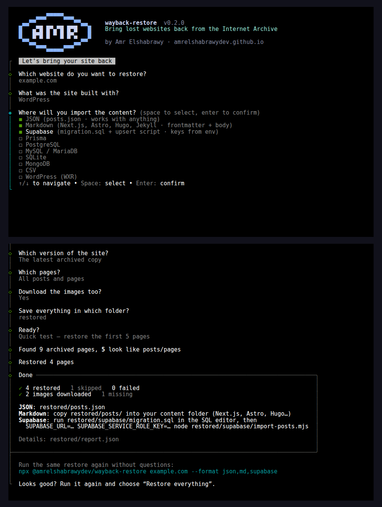

# wayback-restore

**Bring a lost website back from the Internet Archive** — posts, pages and images, with the original URLs, titles, meta descriptions and Arabic/RTL slugs intact — and get import-ready files for **Supabase, Prisma, PostgreSQL, MySQL, SQLite, MongoDB, Markdown, CSV or WordPress**.

[](https://www.npmjs.com/package/@amrelshabrawydev/wayback-restore)
[](https://github.com/AmrElshabrawyDev/wayback-restore/actions/workflows/ci.yml)
[](LICENSE)

```bash
npx @amrelshabrawydev/wayback-restore
```

Run it with no arguments and it walks you through everything — no long commands to remember:



## Why

A client's WordPress database was destroyed — no backup — while Google was still showing **182 of its articles** in search results. Those articles were the company's main source of customer calls. Rebuilding them by hand from the Wayback Machine would have taken weeks, and every day offline meant visitors landing on error pages.

This tool is the reusable version of the scripts I wrote to bring that content back. It:

- **finds every archived page** of the domain through the Wayback CDX API and keeps the newest copy of each,
- **skips noise** — tag/category archives, feeds, `wp-admin`, attachments, `?p=` links, files,
- **extracts what matters for SEO**: title, meta description (Yoast / Rank Math), canonical, dates, author, categories, tags, featured image,
- **cleans the article HTML**: removes share buttons, ads, table-of-contents widgets, comments, inline styles and page-builder wrappers; unwraps lazy-loaded images; keeps YouTube/Vimeo/Maps embeds,
- **keeps your URLs**: slugs are decoded (`/نقل-عفش-الكويت/`, not `/%D9%86…/`) and internal links become root-relative,
- **downloads the images** (archive first, then the live site), rewrites them to local paths, and **removes images that can't be found** instead of leaving broken `` tags,
- **caches every page**, so an interrupted run resumes without hitting the archive again,
- **exports to the platform you use** — and never needs your database credentials (see [Exports](#exports)).

Read the full story: [How I recovered 182 articles from the Internet Archive](https://amrelshabrawydev.github.io/blog/wordpress-to-nextjs-arabic-migration) (Arabic) · [WordPress to Next.js migration without losing SEO](https://amrelshabrawydev.github.io/blog/wordpress-to-nextjs-migration-seo).

## Quick start

Requires Node.js 20.18 or newer.

**Interactive** (recommended):

```bash
npx @amrelshabrawydev/wayback-restore
```

It asks for the domain, what the site was built with, where you'll import the content, which version of the site to use (e.g. *before it was hacked*), whether to download images — then offers a **quick 5-page test** before the full run, and prints the one-line command to repeat it.

**One command** (scripts, CI):

```bash
# see what would be restored (only queries the archive index)
npx @amrelshabrawydev/wayback-restore example.com --dry-run

# try a few pages first
npx @amrelshabrawydev/wayback-restore example.com --limit 5

# restore everything for Supabase + Markdown
npx @amrelshabrawydev/wayback-restore example.com --format supabase,md
```

Install it globally to use the short `wayback-restore` command:

```bash
npm i -g @amrelshabrawydev/wayback-restore
wayback-restore example.com
```

## Exports

Choose one or more with `--format` (or in interactive mode). Every export is a **file you run yourself** — the tool never connects to your database, so it never needs your passwords or keys.

| `--format` | You get | How to import |
|---|---|---|
| `json` *(default)* | `posts.json` | Anything |
| `md` | `posts/<slug>.md` with frontmatter | Copy into Next.js / Astro / Hugo / Jekyll content |
| `supabase` | `supabase/migration.sql`, `supabase/import-posts.mjs` | Run the SQL in Supabase, then `SUPABASE_URL=… SUPABASE_SERVICE_ROLE_KEY=… node restored/supabase/import-posts.mjs` |
| `prisma` | `prisma/model.prisma`, `prisma/import-posts.mjs` | Add the model, `prisma migrate dev`, then `node restored/prisma/import-posts.mjs` |
| `postgres` | `sql/posts.postgres.sql` | `psql "$DATABASE_URL" -f restored/sql/posts.postgres.sql` |
| `mysql` | `sql/posts.mysql.sql` (utf8mb4) | `mysql -u user -p db < restored/sql/posts.mysql.sql` |
| `sqlite` | `sql/posts.sqlite.sql` | `sqlite3 site.db < restored/sql/posts.sqlite.sql` |
| `mongodb` | `mongodb/posts.ndjson` | `mongoimport --uri "$MONGODB_URI" --collection posts --file restored/mongodb/posts.ndjson` |
| `csv` | `posts.csv` (UTF-8 with BOM, opens correctly in Excel) | Excel, Google Sheets, Airtable, Notion |
| `wordpress` | `wordpress/wordpress-export.xml` (WXR) | A fresh WordPress: **Tools → Import → WordPress** |

All SQL files create the table if needed and **upsert on `slug`**, so you can run them again safely. Use `--table articles` to change the table name.

Every database export uses the same columns:

`slug` (primary key) · `path` · `title` · `excerpt` · `content` (HTML) · `featured_image` · `published_at` · `updated_at` · `author` · `categories` · `tags` · `lang` · `type` · `original_url` · `archived_at`

Images are saved to `restored/public/…` mirroring their original paths (`/wp-content/uploads/2023/05/photo.jpg`), so you can copy the folder into your app's `public/` and every image URL keeps working.

## Options

| Option | Default | Description |
|---|---|---|
| `-o, --out <dir>` | `restored` | Output folder |
| `-f, --format <list>` | `json` | See [Exports](#exports) |
| `--table <name>` | `posts` | Table / collection name for database exports |
| `--from <date>` / `--to <date>` | — | Only use snapshots in this range (`2023`, `2023-05`, `20230501`) — e.g. the last copy *before the site was hacked* |
| `--include <regex>` | — | Only restore paths matching this pattern, e.g. `"^/blog/"` |
| `--exclude <regex>` | — | Skip paths matching this pattern |
| `--types <list>` | `post,page,unknown` | Page types to keep |
| `--min-words <n>` | `50` | Skip near-empty pages |
| `--limit <n>` | — | Restore at most *n* pages |
| `--no-images` | — | Don't download images |
| `--image-base <url>` | `""` | Prefix for rewritten image URLs, e.g. `https://cdn.example.com` |
| `--image-source <list>` | `archive,live` | Where to look for images, in order |
| `--keep-missing-images` | — | Keep `` tags whose image couldn't be downloaded |
| `--delay <ms>` | `1500` | Pause between archive requests — please be gentle with the Internet Archive |
| `--dry-run` | — | Only list the pages that would be restored |
| `-i, --interactive` | — | Ask questions (the default when no domain is given) |
| `-q, --quiet` | — | Less output |

## Use it from code

```js
import { restore } from "@amrelshabrawydev/wayback-restore";

const { posts, report } = await restore({
  domain: "example.com",
  outDir: "restored",
  formats: ["json", "postgres"],
  include: /^\/blog\//,
  log: console.log,
});
```

Lower-level helpers are exported too: `listSnapshots`, `extractPost`, `restoreImages`, `exportPosts`, `toSql`, `toCsv`, `toMongoNdjson`, `toWxr`, `toMarkdown`, `isContentUrl`, `unwrapWaybackUrl`, `slugFromUrl`.

### Serving the old URLs in Next.js

Keep WordPress's trailing slashes so every URL Google knows stays identical, and decode Arabic slugs before looking them up:

```js
// next.config.js
export default { trailingSlash: true };
```

```tsx
// app/[slug]/page.tsx
export default async function Post({ params }) {
  const slug = decodeURIComponent((await params).slug);
  // …find the post by slug
}
```

## Good to know

- **The archive doesn't have everything.** Some pages or images were never captured, or only an older version was. Check `report.json` and review your most important pages by hand.
- **Only restore content you own** (or have permission to restore).
- **Be gentle with the Internet Archive** — it's a free, non-profit service. Keep the default delay, and use the quick test / `--dry-run` first. If it saved you, [consider donating](https://archive.org/donate).
- The tool only reads public snapshots: no logins, no API keys.

## Roadmap

WordPress sites work today; other platforms come in the next releases. See [ROADMAP.md](ROADMAP.md) — ideas and pull requests welcome.

## Development

```bash
git clone https://github.com/AmrElshabrawyDev/wayback-restore.git
cd wayback-restore
npm install
npm test
node bin/cli.js          # interactive mode
```

Tests run offline against a fake archive. `WAYBACK_ENDPOINT=http://localhost:8080` points the tool at a local mirror for manual testing.

## License

[MIT](LICENSE) © [Amr Elshabrawy](https://amrelshabrawydev.github.io)
